### Sentinel-A2A

Sentinel-A2A is a runtime security firewall for AI-agent communication. It inspects agent messages, applies authorization and risk policies, records security events, and blocks unsafe MCP tool execution before downstream actions run.

## Deployment

This repository supports both required public hosting surfaces without changing the application code:

- **Replit:** the Replit workflow runs `Sentinel-A2A/frontend/app.py` on port `5000`. The Replit deployment must be public and use a `replit.app` or `replit.dev` URL.
- **Streamlit Community Cloud:** configure the main file as `Sentinel-A2A/frontend/app.py`. Streamlit Cloud supplies its own port (`8501`); do not hard-code a port in `.streamlit/config.toml`.

Configure `GEMINI_API_KEY` and any Firestore credentials only through the hosting provider's secret manager. Copy the safe template at `Sentinel-A2A/.streamlit/secrets.toml.example` if needed. Never commit `secrets.toml` or `credentials.toml`.

For Replit, add the complete Google service-account JSON as the secret `FIRESTORE_CREDENTIALS_JSON` and set `FIRESTORE_ENABLED=true`. This enables the Replit deployment to read and write the same persistent Firestore security events as Streamlit. The application still uses local in-memory fallback when these secrets are absent.

The local rule-based analyzer and in-memory event store are intentional fallbacks when optional Gemini or Firestore services are unavailable.

### Made With Replit (Partner Track) 

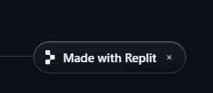

Replit Cloud Deployment & Hosting Badge
Description:
The application is hosted and deployed through Replit using the checked-in `.replit` workflow and a public Replit deployment URL. Replit is the required hosting platform for the Replit track; Streamlit is the web application framework.

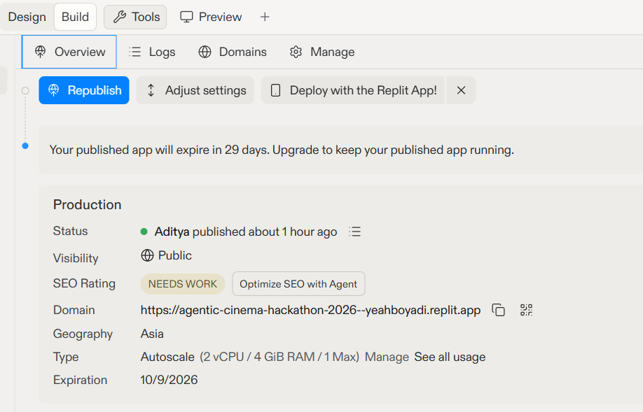

Future Prospects:
Persistent Reserved Hosting: Transition from temporary deployments to Replit Reserved VM deployment infrastructure to guarantee 100% uptime without auto-sleep limits.
Custom Domain & SSL Mapping: Attach a custom domain (e.g., firewall.sentinel-a2a.org) with SSL termination via Replit Domains for enterprise trust.
Edge Routing & Multi-Region Support: Leverage edge deployment nodes to minimize latency for real-time Agent-to-Agent (A2A) payload inspection globally.

### Session Management & Cache Control (Clear cache & reload)

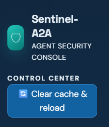

Description:
The dashboard includes a dedicated "Clear cache & reload" control in the sidebar menu. This utility flushes Streamlit's temporary session state memory, resets local telemetry counts, and clears cached Gemini risk evaluation responses to ensure a clean, deterministic testing environment during live security demonstrations.

Future Prospects:
Granular Cache Purging: Allow administrators to clear selective cache buckets (e.g., purging only model inference responses while preserving historical audit logs).
Automated Cache TTL & Expiration Policies: Implement dynamic Time-To-Live (TTL) mechanisms that invalidate cached agent risk evaluations whenever firewall security policies or risk scoring rules are modified.
Session Diagnostics & Health Monitoring: Pair session resets with automated diagnostic reports tracking memory usage, active websocket connections, and API latency before and after clearing state.

### Project Overview & Architecture (About Sentinel-A2A)

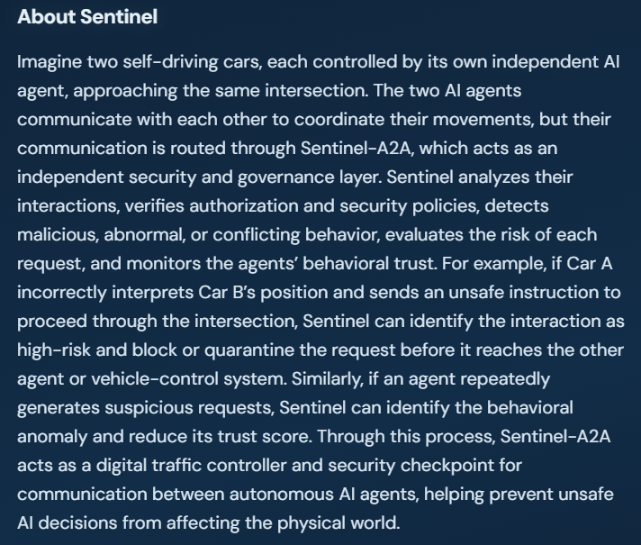

Description:
The About section outlines the core mission and real-world scenario powering Sentinel-A2A. It illustrates an autonomous traffic system where independent AI agents—such as self-driving vehicles—must communicate across intersections. Sentinel-A2A acts as a zero-trust intermediary layer: intercepting inter-agent payloads, enforcing safety and governance policies, evaluating contextual risk, and dynamically adjusting agent trust scores before requests reach physical vehicle-control systems or downstream infrastructure.

### Support & Developer Contact (Suggestions or Complaints)

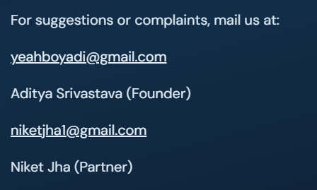

Description:
The dashboard incorporates a dedicated contact and support interface providing direct lines of communication for suggestions, issue reports, and feedback. It displays the primary developer contacts:
Aditya Srivastava (Founder): yeahboyadi@gmail.com
Niket Jha (Partner): niketjha1@gmail.com

Future Prospects:
Automated Incident Ticketing: Integrate an embedded support widget that automatically attaches system diagnostic logs, recent payload telemetry, and active firewall configuration states directly to submitted bug reports.
Community & Developer Hub: Expand support into a dedicated Discord or GitHub Discussions community hub for open-source contributors and security researchers testing MCP firewall rules.
In-App Feedback Analytics: Add real-time sentiment analysis and structured feedback forms to triage user suggestions and prioritize incoming feature requests.

### Core Identity & Header (Sentinel-A2A: Runtime Security Firewall for AI Agents)

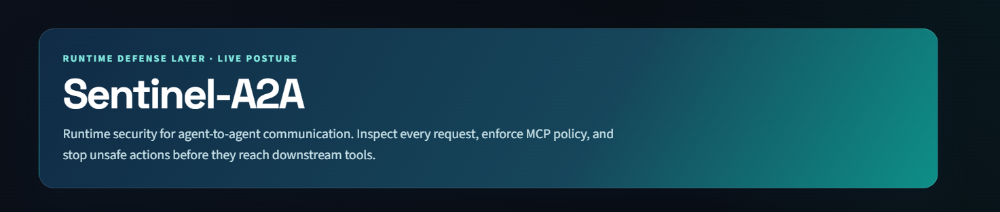

Description:
The primary landing header establishes Sentinel-A2A's core purpose as a specialized runtime security firewall. It explicitly highlights the platform's focus: continuously monitoring communication between autonomous AI agents and safeguarding Model Context Protocol (MCP) tools from malicious, manipulated, or unauthorized execution requests in real time.

### Attack Simulator & Threat Vector Selection (Select Attack Scenario)

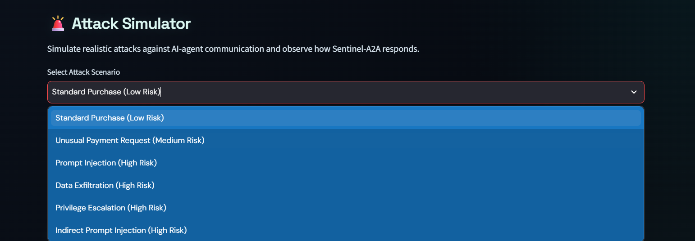

Description:
The Attack Simulator serves as an interactive sandbox designed to stress-test Sentinel-A2A’s defensive engine against various inter-agent attack vectors. Users can launch both benign baseline transactions and synthetic malicious payloads through a dropdown menu to evaluate how the firewall inspects, scores, and blocks threats in real time.

The simulator features pre-configured test scenarios spanning multiple risk profiles:
Standard Purchase (Low Risk): Baseline benign transaction to establish normal behavioral metrics.
Unusual Payment Request (Medium Risk): Anomalous financial payload triggering financial policy constraints.
Prompt Injection (High Risk): Direct system-prompt override targeting inter-agent instructions.
Data Exfiltration (High Risk): Payload designed to siphon sensitive data across agent boundaries.
Privilege Escalation (High Risk): Unauthorized MCP tool invocation seeking higher system permissions.
Indirect Prompt Injection (High Risk): Malicious instructions embedded within secondary untrusted inputs or retrieved contexts.

Future Prospects:
Custom Payload Builder & Fuzzer: Allow security teams to craft custom JSON/text payloads and run automated fuzzing suites against MCP endpoints to uncover zero-day vulnerabilities.
Automated Red Teaming Harness: Integrate continuous multi-turn attack simulation loops where an adversarial agent actively attempts to bypass firewall rules while the firewall updates its scoring models dynamically.
Attack Replay & Regression Suite: Export recorded attack sequences into automated CI/CD integration tests to verify firewall policy performance across new code releases.

### Security Telemetry Counters & Database Integration (Security Overview & Analytics)

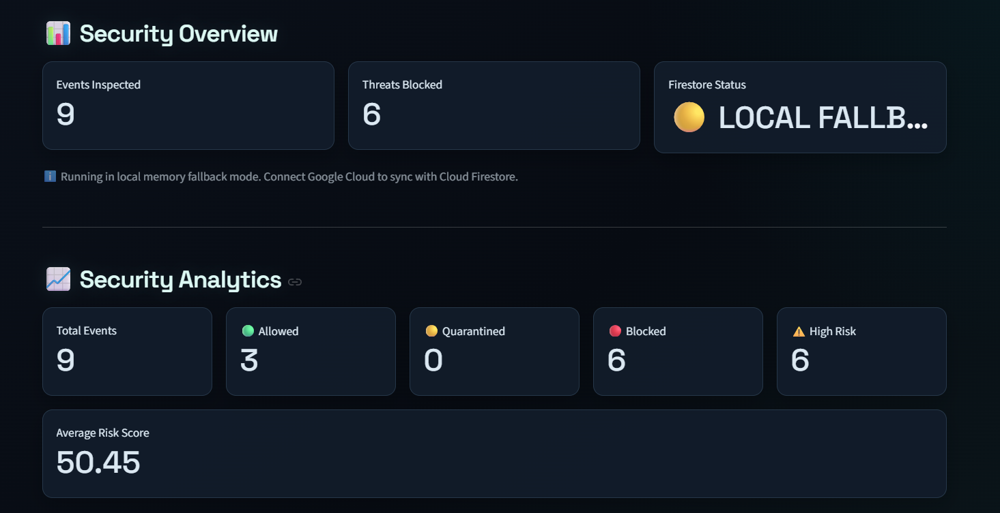

Description:
This section displays real-time security metrics, risk telemetry, and persistence status across the Sentinel-A2A platform:
Security Overview: Tracks core key performance indicators including Events Inspected and Threats Blocked.
Firestore Connection Status: Displays live connection state (LOCAL FALLBACK), alerting operators that the firewall is executing in local in-memory state mode when Google Cloud Firestore credentials are not explicitly attached.
Security Analytics: Breaks down inspected traffic across distinct disposition buckets (Total Events, Allowed, Quarantined, Blocked, and High Risk), accompanied by a rolling Average Risk Score metric.

Future Prospects:
Seamless Firestore Sync: Enable auto-discovery of GCP credentials to seamlessly transition from Local Fallback mode to persistent Cloud Firestore sync without downtime.
Time-Series Analytics: Expand static counters into interactive time-series graphs tracking risk score trends, peak attack windows, and threat distributions over 24-hour, 7-day, or 30-day windows.
SIEM Integration & Export: Provide built-in webhook exporters to stream telemetry counters directly into enterprise monitoring suites like Datadog, Splunk, or Google Cloud Operations (Stackdriver).

### Interactive Visualizations (Risk Distribution & MCP Tool Activity)

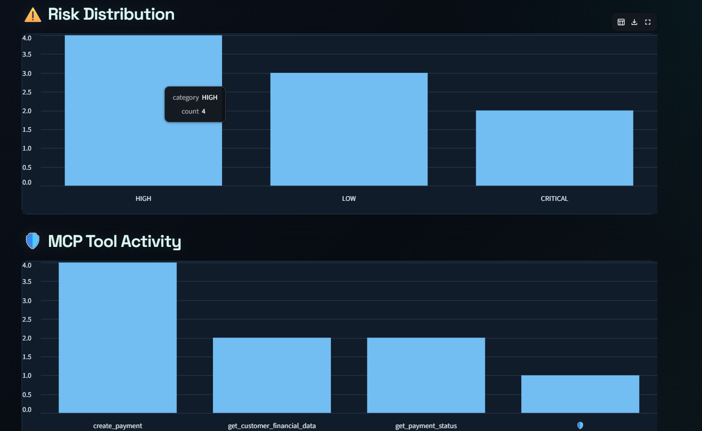

Description:
This section provides data visualizations to help operators quickly assess security trends across agent communications:
Risk Distribution: A bar chart categorizing evaluated payloads by severity level (e.g., Low, Medium, High, Critical) to surface risk trends at a glance.
MCP Tool Activity: A dedicated usage chart tracking invocation frequency across specific Model Context Protocol (MCP) tools to identify heavily targeted or frequently executed system capabilities.

Future Prospects:
Drill-Down Filtering: Enable interactive chart clicking to instantly filter raw audit logs by selected risk tiers or specific MCP tools.
Anomalous Volume Spikes: Integrate automated spike detection to alert operators when an individual MCP tool experiences an unusual surge in call volume.
Comparative Heatmaps: Add heatmaps mapping agent identity against specific MCP tool calls to detect cross-agent lateral movement attempts.

### Real-Time Firewall Verdict & AI Threat Analysis (Sentinel-A2A Response & Gemini Security Intelligence)

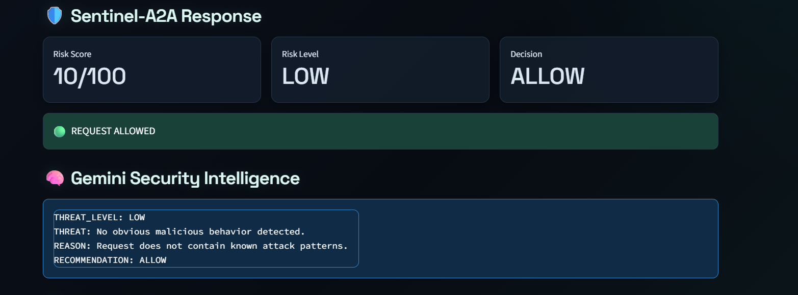.

Description:
This module displays the live inspection output generated after evaluating an inter-agent payload through the security engine:
Sentinel-A2A Response: Renders immediate policy metrics including a numerical Risk Score (e.g., 10/100), categorical Risk Level (LOW), and final access control Decision (ALLOW). A prominent status badge (REQUEST ALLOWED) provides instant visual indication for security operators.
Gemini Security Intelligence: Displays deep contextual reasoning powered by the Gemini LLM engine. It provides structured JSON/text key-value diagnostics including THREAT_LEVEL, identified THREAT vectors, underlying security REASON, and an actionable mitigation RECOMMENDATION.

Future Prospects:
Gemini Security Consensus: Combine multiple Gemini security evaluations to create a weighted consensus score for high-stake actions.
Actionable Mitigation Automation: Integrate auto-remediation triggers that dynamically transform BLOCK or QUARANTINE decisions into system actions like temporary API key revocation or automated security team alerts.
Explainability & Contextual Auditing: Provide collapsible detailed prompt traces so security auditors can inspect the exact system prompts and contextual parameters passed to Gemini during evaluation.

### Agent Interception & Parameter Inspection (Inspect Agent Request & Tool Parameters)

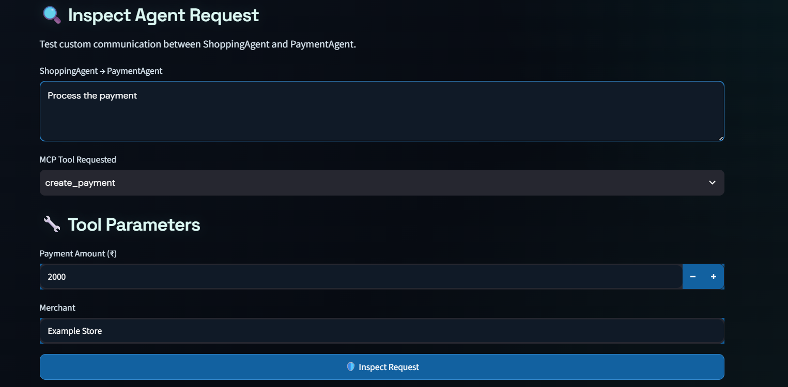.

Description:
This panel allows operators to test and inspect inter-agent communications in real time, specifically demonstrating payload exchanges between a ShoppingAgent and a PaymentAgent.
Agent Request Flow: Intercepts natural language prompts (e.g., "Process payment for the selected laptop") sent across agent boundaries.
MCP Tool & Parameters: Identifies the target Model Context Protocol tool invoked (create_payment) alongside its explicit arguments, such as Payment Amount (₹) (2000) and Merchant (Example Store).

Future Prospects:
Schema Validation & Enforcement: Automatically compare incoming tool parameters against strictly defined JSON schemas to block malformed or out-of-bounds inputs prior to LLM processing.
Dynamic Parameter Sanitization: Automatically scrub or mask sensitive parameters (such as credit card tokens, personal identifiers, or secret keys) before passing payloads downstream.
Multi-Agent Flow Visualization: Expand the two-agent view into a visual DAG (Directed Acyclic Graph) showing multi-hop communication paths across entire agent swarms.

### Request Trigger, Analysis & Rule Engine (Inspect Request, Sentinel-A2A Analysis & Detected Threats)

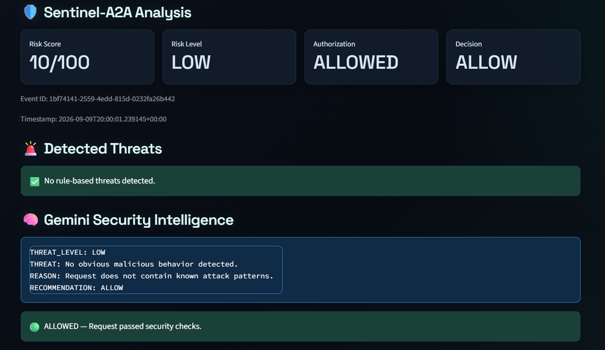.

Description:
This panel details the execution trigger, risk telemetry, and initial rule-based security evaluation when an agent request is inspected:
Trigger & Event Logging: Features the Inspect Request action button, which processes the payload and generates a unique audit tracking identifier (Recorded Event ID: LOCAL_eee2dea0).
Sentinel-A2A Analysis: Displays detailed transaction metadata including Risk Score (10/100), Risk Level (LOW), Authorization state (ALLOWED), final Decision (ALLOW), full unique Event ID, and a UTC Timestamp.
Detected Threats Engine: Runs static and heuristic security checks against known attack patterns, returning real-time status banners (e.g., No rule-based threats detected.).

Future Prospects:
Custom Signature & YARA Rules: Support user-defined regex and YARA-style security rules for instant deterministic matching prior to LLM evaluation.
Granular Authorization Mapping: Integrate Role-Based Access Control (RBAC) to restrict specific MCP tool executions based on requesting agent identities and token scopes.
Audit Log Export: Allow security analysts to download or stream complete event payloads and analysis metadata directly to external log management platforms.

### Downstream Target Response & Execution Result (Payment Agent Response & MCP Tool Result)

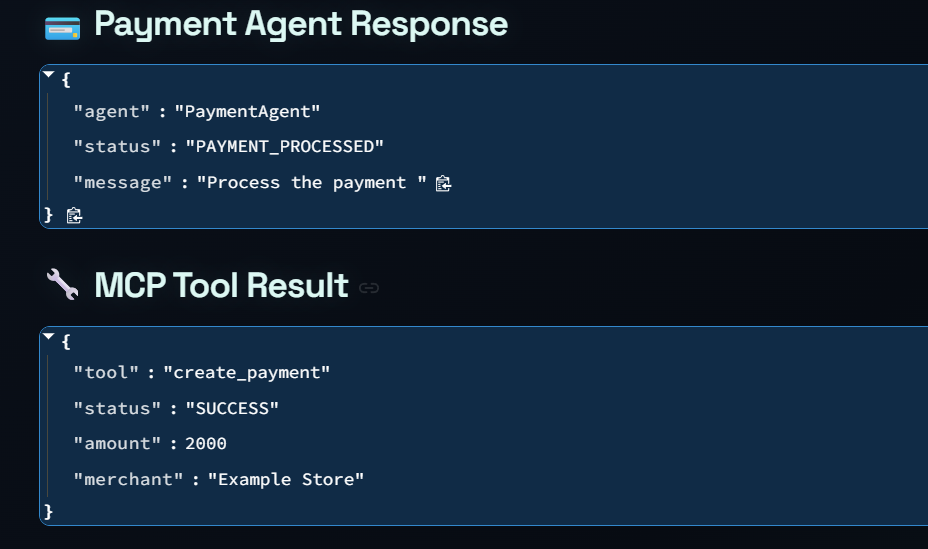.

Description:
This panel displays the structured JSON outputs generated after a request successfully clears the Sentinel-A2A firewall and executes on downstream target systems:
Payment Agent Response: Renders the receiving agent's response payload confirming state transition (e.g., "agent": "PaymentAgent", "status": "PAYMENT_PROCESSED", and the processed "message").
MCP Tool Result: Captures the final execution output from the underlying Model Context Protocol tool (e.g., "tool": "create_payment", "status": "SUCCESS"), detailing confirmed transaction attributes such as "amount": 2000 and "merchant": "Example Store".

Future Prospects:
Response Payload Inspection (Outbound Firewall): Extend firewall rules to inspect downstream responses and tool execution outputs, ensuring sensitive data or unauthorized system tokens are not leaked back to requesting agents.
Asynchronous Webhook Notifications: Stream verified tool execution outputs directly to external audit systems or message queues (such as Kafka or Google Cloud Pub/Sub) for downstream monitoring.
Transaction Rollback & Circuit Breakers: Implement automatic transaction rollback triggers or circuit breakers when downstream tool execution outputs contain unexpected errors or state mismatches.

### Audit Trail & Audit Log History (Security Event History)

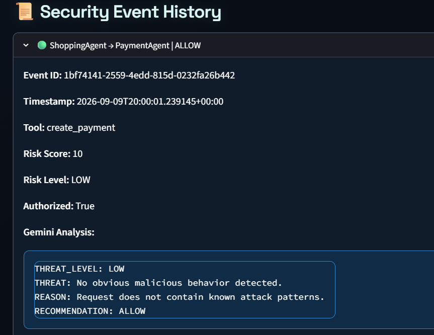.

Description:
The Security Event History provides an expandable, persistent audit log of all inspected Agent-to-Agent (A2A) interactions. Each record features a collapsible header summarizing the communication path and disposition (e.g., ShoppingAgent → PaymentAgent | ALLOW) and expands to reveal comprehensive transaction metadata:
Event & Timing Data: Unique Event ID (eee2dea0-...) and exact ISO UTC Timestamp (2026-09-09T04:21:33...).
Execution Parameters: Target MCP Tool (create_payment), numerical Risk Score (10), categorical Risk Level (LOW), and Authorized flag (True).
AI Analysis Snapshot: Historical record of the Gemini Analysis diagnostics, capturing threat level, threat details, reasoning, and system recommendation at the exact time of execution.

Future Prospects:
Tamper-Evident Audit Ledger: Cryptographically sign each event entry using hash-chaining or store event hashes on an immutable ledger to prevent retroactive log modification.
Full-Text & Faceted Search: Add advanced search filters allowing compliance officers to query historical events by agent ID, tool name, risk range, or keyword across Gemini analysis outputs.
Automated Compliance Reporting: Generate one-click PDF/CSV exportable compliance reports mapped to enterprise security standards (such as SOC2, ISO 27001, or NIST AI Risk Management Framework).

### Google Gemini 

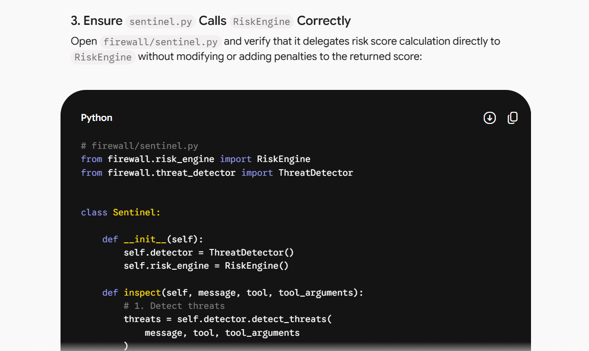. 

### DEPLOYED REPLIT LINK (MAIN DEPLOYMENT MEDIUM) : 
https://agentic-cinema-hackathon-2026--yeahboyadi.replit.app 

### DEPLOYED STREAMLIT LINK (ALTERNATIVE DEPLOYMENT MEDIUM) (TO BE USED AFTER SUSPENSION OF REPLIT LINK) : 
https://agenticcinemahackathon2026-exzbhlcw3vk4ukfbnmbbud.streamlit.app/
